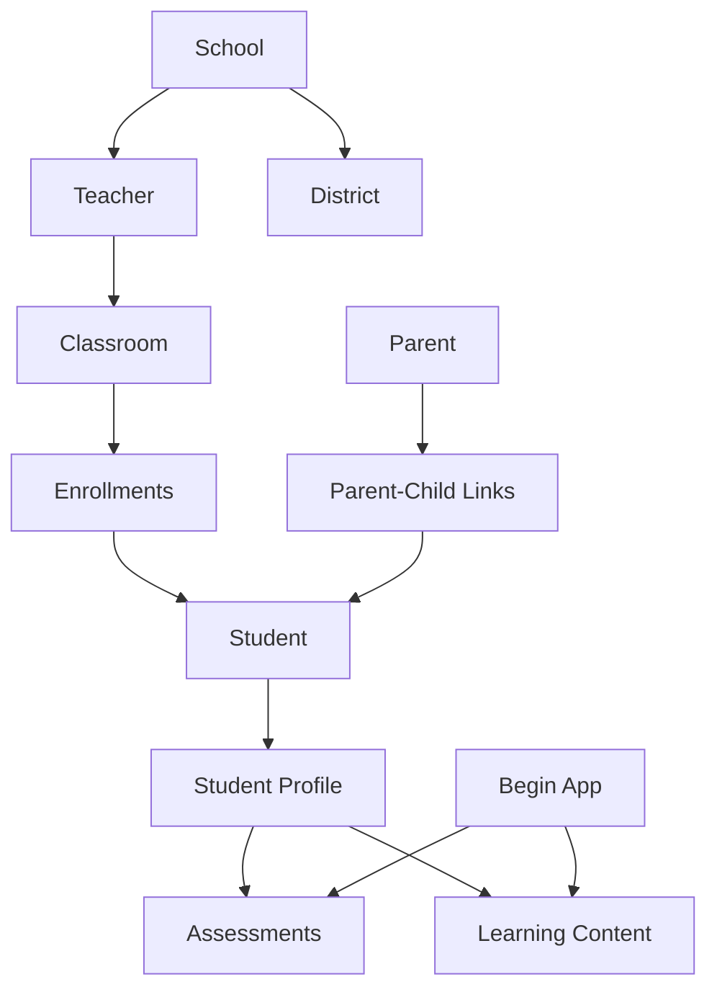

# Learning Profile Platform Architecture
*Designed for scale: Individual Teachers → Schools → Districts → Begin Integration*

## 🎯 Core Design Principles

1. **Student-Centric**: Students own their data across all relationships
2. **FERPA Compliant**: Role-based access with educational purpose tracking
3. **Multi-Tenant Ready**: Schools can operate independently while sharing best practices
4. **Future-Proof**: Designed for Begin app integration and advanced analytics
5. **Flexible but Secure**: Data flows between roles with proper authorization

---

## 🏗️ Data Architecture

### **Central Entities**



### **1. Student-Centric Model**

**Students are the permanent entities** - they persist across teachers, classrooms, and years.

```sql
-- Core student entity (permanent)
CREATE TABLE students (
    id UUID PRIMARY KEY DEFAULT gen_random_uuid(),
    student_number TEXT UNIQUE, -- School assigned ID
    first_name TEXT NOT NULL,
    last_name TEXT NOT NULL,
    date_of_birth DATE,
    grade_level TEXT,
    school_id UUID REFERENCES schools(id),
    created_at TIMESTAMP DEFAULT NOW(),
    updated_at TIMESTAMP DEFAULT NOW(),
    -- Privacy & compliance
    ferpa_directory_opt_out BOOLEAN DEFAULT false,
    data_retention_preference TEXT DEFAULT 'standard' -- 'minimum', 'standard', 'extended'
);

-- Learning profiles belong to students (cumulative over time)
CREATE TABLE student_learning_profiles (
    id UUID PRIMARY KEY DEFAULT gen_random_uuid(),
    student_id UUID REFERENCES students(id),
    assessment_date TIMESTAMP DEFAULT NOW(),
    personality_label TEXT,
    learning_style_scores JSONB, -- flexibility for different assessment types
    strengths JSONB,
    challenges JSONB,
    recommendations JSONB,
    assessment_type TEXT DEFAULT 'speakaboos_v1',
    administered_by UUID REFERENCES teachers(id),
    school_year TEXT,
    grade_level TEXT
);
```

### **2. Relationship-Based Access Control**

**Teachers, Parents, and Students have relationships, not ownership.**

```sql
-- Teacher-Student relationships (changes annually)
CREATE TABLE teacher_student_relationships (
    id UUID PRIMARY KEY DEFAULT gen_random_uuid(),
    teacher_id UUID REFERENCES teachers(id),
    student_id UUID REFERENCES students(id),
    classroom_id UUID REFERENCES classrooms(id),
    relationship_type TEXT DEFAULT 'primary_teacher', -- 'primary_teacher', 'specialist', 'support'
    school_year TEXT NOT NULL,
    start_date DATE DEFAULT CURRENT_DATE,
    end_date DATE, -- NULL = active
    educational_purpose TEXT NOT NULL, -- FERPA requirement
    permissions JSONB DEFAULT '{
        "view_profile": true,
        "view_assessments": true,
        "create_assessments": true,
        "share_with_parents": true
    }',
    created_at TIMESTAMP DEFAULT NOW()
);

-- Parent-Student relationships (permanent, with custody considerations)
CREATE TABLE parent_student_relationships (
    id UUID PRIMARY KEY DEFAULT gen_random_uuid(),
    parent_id UUID REFERENCES parents(id),
    student_id UUID REFERENCES students(id),
    relationship_type TEXT NOT NULL, -- 'parent', 'guardian', 'custodian', 'emergency_contact'
    custody_status TEXT DEFAULT 'full', -- 'full', 'joint', 'limited', 'none'
    can_access_data BOOLEAN DEFAULT true,
    can_consent_sharing BOOLEAN DEFAULT true,
    verified_at TIMESTAMP,
    verification_method TEXT, -- 'school_enrollment', 'birth_certificate', 'court_order'
    created_at TIMESTAMP DEFAULT NOW()
);
```

### **3. Multi-Tenant School Structure**

```sql
-- Schools are the primary tenant boundary
CREATE TABLE schools (
    id UUID PRIMARY KEY DEFAULT gen_random_uuid(),
    name TEXT NOT NULL,
    district_id UUID REFERENCES districts(id),
    school_code TEXT UNIQUE, -- State/district assigned
    address JSONB,
    principal_email TEXT,
    ferpa_officer_email TEXT,
    privacy_settings JSONB DEFAULT '{
        "allow_teacher_data_export": true,
        "require_assessment_approval": false,
        "data_retention_years": 7,
        "allow_cross_year_access": true
    }',
    subscription_tier TEXT DEFAULT 'free', -- 'free', 'school', 'district', 'enterprise'
    created_at TIMESTAMP DEFAULT NOW()
);

-- Classrooms belong to schools and teachers
CREATE TABLE classrooms (
    id UUID PRIMARY KEY DEFAULT gen_random_uuid(),
    school_id UUID REFERENCES schools(id),
    primary_teacher_id UUID REFERENCES teachers(id),
    name TEXT NOT NULL,
    grade_level TEXT,
    subject_area TEXT, -- For middle/high school
    school_year TEXT NOT NULL,
    room_number TEXT,
    max_enrollment INTEGER DEFAULT 30,
    is_active BOOLEAN DEFAULT true,
    created_at TIMESTAMP DEFAULT NOW(),
    
    UNIQUE(school_id, name, school_year) -- Prevent duplicate classrooms
);
```

### **4. Enhanced User Management**

```sql
-- Teachers with school affiliation
CREATE TABLE teachers (
    id UUID PRIMARY KEY DEFAULT gen_random_uuid(),
    email TEXT UNIQUE NOT NULL,
    first_name TEXT NOT NULL,
    last_name TEXT NOT NULL,
    school_id UUID REFERENCES schools(id),
    employee_id TEXT, -- School assigned ID
    grade_levels TEXT[], -- ['K', '1', '2'] for multi-grade teachers
    subject_areas TEXT[], -- ['Math', 'Science'] for specialists
    role TEXT DEFAULT 'teacher', -- 'teacher', 'specialist', 'admin', 'principal'
    certification_status TEXT DEFAULT 'verified',
    hire_date DATE,
    is_active BOOLEAN DEFAULT true,
    permissions JSONB DEFAULT '{
        "view_student_profiles": true,
        "create_assessments": true,
        "export_data": false,
        "manage_classroom": true
    }',
    created_at TIMESTAMP DEFAULT NOW()
);

-- Parents with enhanced verification
CREATE TABLE parents (
    id UUID PRIMARY KEY DEFAULT gen_random_uuid(),
    email TEXT UNIQUE NOT NULL,
    first_name TEXT NOT NULL,
    last_name TEXT NOT NULL,
    phone TEXT,
    preferred_language TEXT DEFAULT 'en',
    communication_preferences JSONB DEFAULT '{
        "email_updates": true,
        "sms_updates": false,
        "assessment_notifications": true,
        "progress_reports": true
    }',
    verification_status TEXT DEFAULT 'pending', -- 'pending', 'verified', 'rejected'
    verification_documents JSONB, -- Store verification info
    created_at TIMESTAMP DEFAULT NOW()
);
```

---

## 🔐 Role-Based Access Control (RBAC)

### **Access Patterns by Role:**

#### **Teachers**
```typescript
interface TeacherAccess {
  // Current year students in their classrooms
  currentStudents: Student[]
  
  // Previous years (if school allows)
  historicalStudents?: Student[] // Only if "allow_cross_year_access": true
  
  // Permissions vary by relationship type
  canCreateAssessments: boolean
  canExportData: boolean
  canShareWithParents: boolean
  
  // School boundary enforcement
  schoolId: UUID
  allowedClassrooms: UUID[]
}
```

#### **Parents**  
```typescript
interface ParentAccess {
  // Only their verified children
  children: Student[]
  
  // Historical data access (across all teachers/years)
  canViewHistoricalData: true
  
  // Control sharing permissions
  canManageConsent: boolean
  canExportChildData: boolean
  
  // Custody-aware access
  custodyStatus: 'full' | 'joint' | 'limited'
}
```

#### **School Administrators**
```typescript
interface SchoolAdminAccess {
  // All students in their school
  schoolStudents: Student[]
  
  // Aggregate analytics only (no individual student data without purpose)
  canViewAnalytics: boolean
  canManageTeachers: boolean
  canConfigurePrivacy: boolean
  
  // School boundary enforcement
  schoolId: UUID
}
```

---

## 🔄 Data Flow Architecture

### **1. Student Data Continuity**

**Problem**: How does Maya Patel's data follow her from 2nd grade (Ms. Johnson) to 3rd grade (Mr. Smith)?

**Solution**: Relationship-based access with historical permissions

```typescript
// When Maya moves to 3rd grade:
async function promoteStudent(studentId: UUID, newTeacherId: UUID, newClassroomId: UUID) {
  // 1. End current teacher relationship
  await endTeacherRelationship(studentId, currentSchoolYear)
  
  // 2. Create new teacher relationship
  await createTeacherRelationship({
    studentId,
    teacherId: newTeacherId,
    classroomId: newClassroomId,
    schoolYear: nextSchoolYear,
    educationalPurpose: 'Continuation of educational services'
  })
  
  // 3. Migrate relevant data
  await copyRelevantAssessments(studentId, newTeacherId)
  
  // 4. Update parent notifications
  await notifyParentOfTeacherChange(studentId, newTeacherId)
}
```

### **2. Multi-Year Parent Access**

**Parents can see their child's complete learning journey:**

```sql
-- Parents can access all historical data for their children
SELECT 
  slp.*,
  t.first_name || ' ' || t.last_name as teacher_name,
  c.name as classroom_name,
  slp.school_year
FROM student_learning_profiles slp
JOIN teacher_student_relationships tsr ON tsr.student_id = slp.student_id 
  AND tsr.school_year = slp.school_year
JOIN teachers t ON t.id = tsr.teacher_id
JOIN classrooms c ON c.id = tsr.classroom_id
JOIN parent_student_relationships psr ON psr.student_id = slp.student_id
WHERE 
  psr.parent_id = $parent_id
  AND psr.can_access_data = true
ORDER BY slp.assessment_date DESC;
```

### **3. School-Level Analytics**

**Schools can see aggregate trends without individual student data:**

```sql
-- School can see grade-level learning style trends
SELECT 
  grade_level,
  school_year,
  jsonb_object_agg(
    learning_style, 
    student_count
  ) as learning_style_distribution
FROM (
  SELECT 
    slp.grade_level,
    slp.school_year,
    slp.personality_label as learning_style,
    COUNT(*) as student_count
  FROM student_learning_profiles slp
  JOIN students s ON s.id = slp.student_id
  WHERE 
    s.school_id = $school_id
    AND slp.assessment_date >= NOW() - INTERVAL '2 years'
  GROUP BY slp.grade_level, slp.school_year, slp.personality_label
) aggregated
GROUP BY grade_level, school_year
ORDER BY school_year DESC, grade_level;
```

---

## 🚀 Begin App Integration Architecture

### **Content Recommendation Flow**

```typescript
interface BeginIntegration {
  // 1. Learning profile triggers content matching
  async getPersonalizedContent(studentProfile: LearningProfile): Promise<BeginContent[]> {
    return await beginAPI.getContentForProfile({
      learningStyle: studentProfile.personality_label,
      gradeLevel: studentProfile.grade_level,
      strengths: studentProfile.strengths,
      interests: studentProfile.interests
    })
  }
  
  // 2. Usage data flows back to learning profile
  async trackContentUsage(studentId: UUID, contentId: string, engagement: EngagementData) {
    await updateLearningProfile(studentId, {
      content_preferences: engagement.preferredTypes,
      engagement_patterns: engagement.patterns,
      learning_progress: engagement.masteryIndicators
    })
  }
}
```

### **Assessment Enhancement Flow**

```typescript
// Begin app can contribute assessment data
interface BeginAssessmentData {
  student_id: UUID
  assessment_type: 'begin_play_patterns' | 'begin_content_preferences' | 'begin_social_learning'
  raw_data: Record<string, any>
  derived_insights: {
    learning_preferences: string[]
    social_learning_indicators: string[]
    content_mastery_areas: string[]
  }
}
```

---

## 🛠️ Implementation Strategy

### **Phase 1: Fix Immediate Issues** 
- ✅ Fix 409 classroom conflicts with UPSERT logic
- ✅ Implement proper student-teacher relationship model
- ✅ Add school boundary enforcement

### **Phase 2: Multi-User Support**
- Add parent authentication and child linking
- Implement historical data access for parents
- Add school administrator roles

### **Phase 3: Begin Integration**
- Content recommendation API integration  
- Assessment data bidirectional sync
- Usage analytics and learning insights

### **Phase 4: Advanced Features**
- Multi-school district support
- Advanced privacy controls (COPPA compliance)
- AI-powered learning recommendations
- Predictive analytics for at-risk students

---

## 🔒 Privacy & Compliance

### **FERPA Compliance**
- All student data access requires educational purpose
- Audit trail for every data access
- Parent consent management for data sharing
- Automatic data retention policy enforcement

### **Data Minimization**
- Teachers only see students in their current classrooms (unless historical access granted)
- Parents only see their own children's data
- Schools see aggregated data, not individual student records (without specific purpose)

### **Consent Management**
- Parents control data sharing preferences
- Students can opt out of directory information
- Granular permissions for different data types

---

This architecture solves your immediate classroom conflict issues while building a foundation that scales from individual teachers to entire school systems, with proper data continuity and Begin app integration.